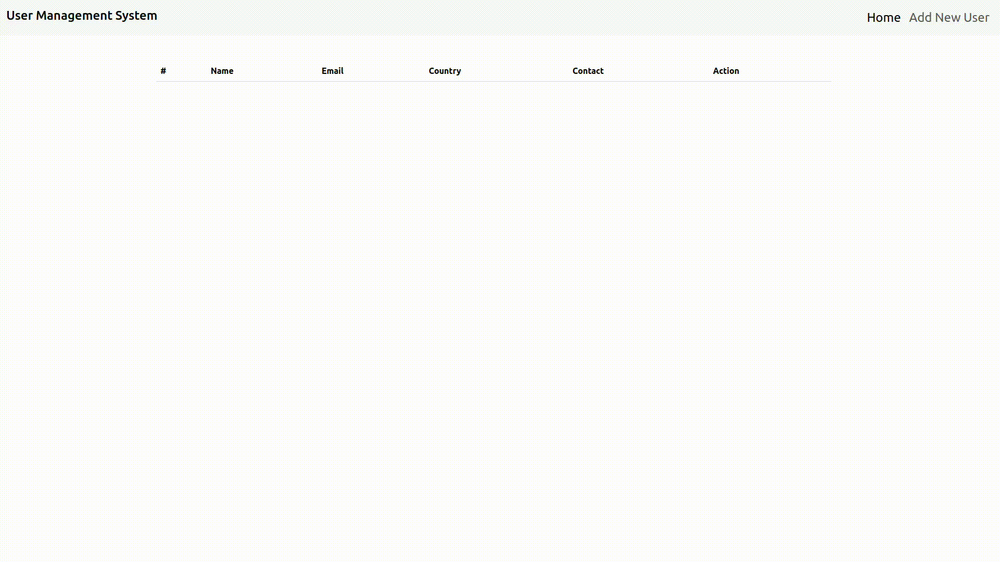

# React &amp; NodeJS User Management System



## Installation

```
git clone https://github.com/bavertorun/user-management-system.git
```

```
cd mser-management-system
```

```
cd backend
```
open db.js<br>
add your mongodb connection uri
```
npm start
```
open new terminal

```
cd ..
```

```
cd frontend
```

```
npm start
```

open http://localhost:3000
